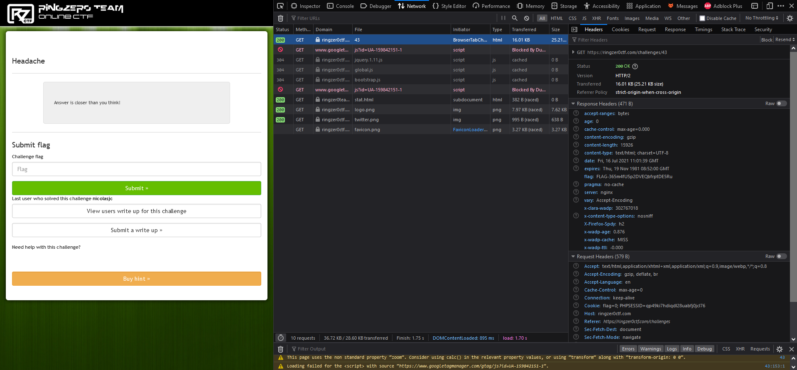

# Ring Zer0 CTF - Headache

This challenge is part of the web section of the RingZer0 CTF and can be found [here](https://ringzer0ctf.com/challenges/43).

This time the challenge's info page only says the following: "Answer is closer than you think!". This made me think that the flag is maybe in this challenge's source page. However, I didn't find anything there.

I then decided to open Firefox's Web Developer Tools to see if there was anything more interesting there. I decided to take a look at the requests that were made in the *Network* tab:

We can see that one of the response's headers of the get request made to access the challenge page is `flag` and its value contains the flag!

## Contact
If you have any questions or remarks don't hesitate to reach out on discord to *therokdaba#9872*.

Go back to the [homepage](https://therokdaba.github.io/) of this website.